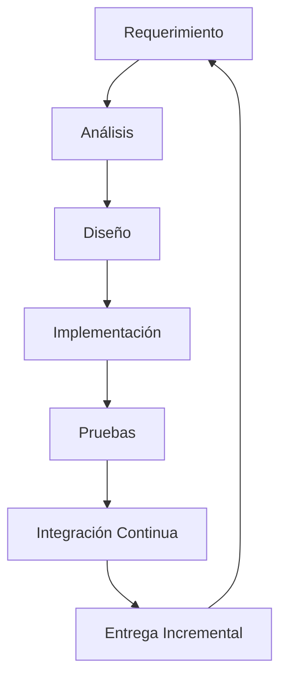
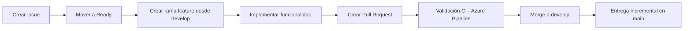
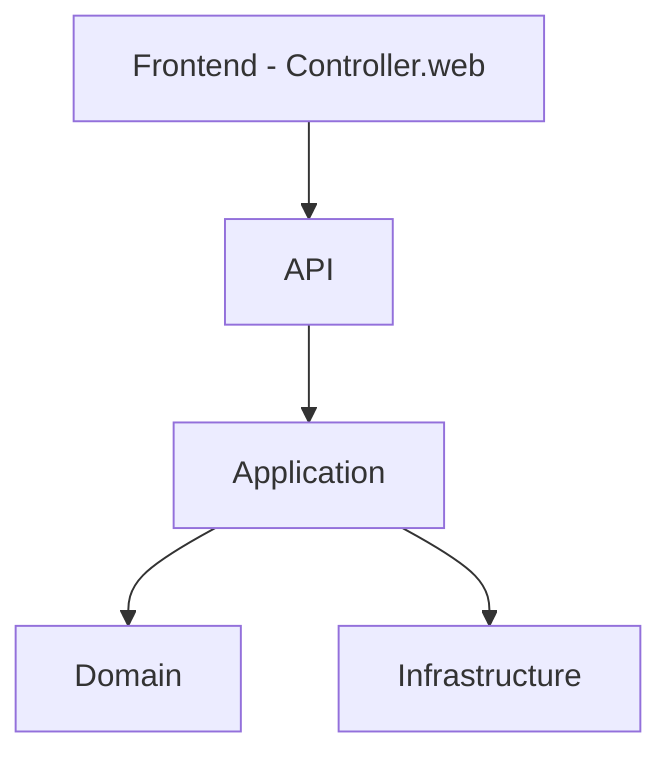
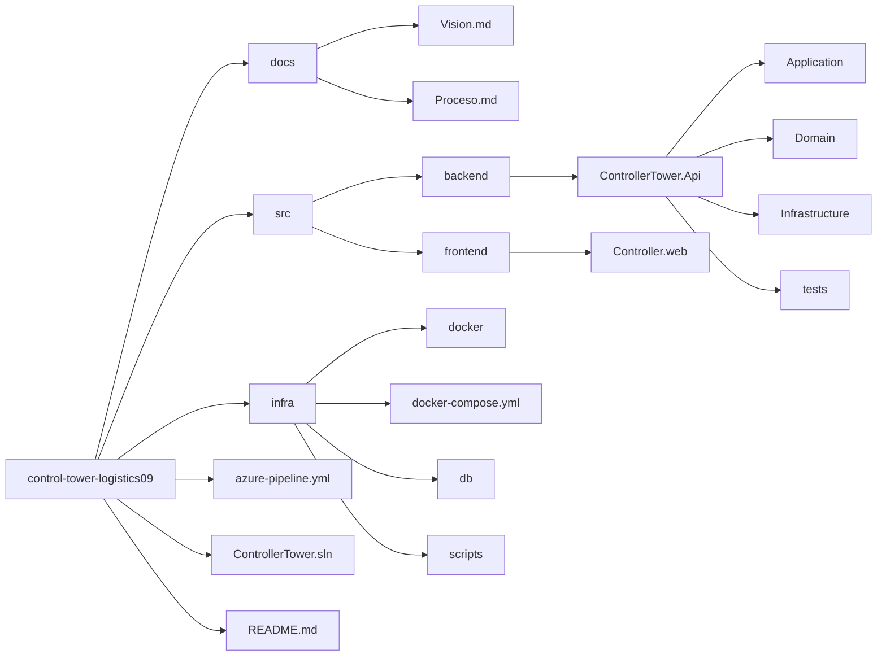

# SDLC Elegido
   El proyecto adopta un SDLC Ágil basado en Kanban, complementado con prácticas de Scrum adaptadas a un entorno de desarrollo 
un modelo ágil simplificado que permite:
•	Entregas incrementales
•	Adaptabilidad a cambios
•	Control visual del flujo de trabajo
•	Priorización continua
•	Integración constante

Este enfoque permite retroalimentación continua y mejora progresiva del sistema.

# Workflow de Desarrollo
     El proyecto utiliza GitHub como repositorio central y aplica un modelo de ramas basado en GitFlow simplificado.

# Estrategia de Ramas
•	main → rama estable (versión lista para entrega)
•	develop → integración de funcionalidades
•	feature/* → nuevas funcionalidades
•	bugfix/* → correcciones de errores

# Flujo de Trabajo

# Modelo de Ramas

Este flujo permite visualizar el estado de cada tarea y evitar acumulación de trabajo en proceso.

# Definition of Ready (DoR)
     Una tarea puede iniciar desarrollo cuando cumple:
•	 Caso de uso definido
•	 Criterios de aceptación claros
•	 Impacto en la capa Domain identificado
•	 Modelo de datos considerado
•	 Dependencias identificadas
•	 Issue registrada en GitHub

# Definition of Done (DoD)
     Una funcionalidad se considera terminada cuando:
•	 Implementación completa
•	 Código ubicado en la capa correcta 

# (Domain, Application, Infrastructure)
•	 Pruebas implementadas
•	 Build exitoso
•	 Azure Pipeline en estado exitoso
•	 Pull Request aprobado
•	 Documentación actualizada
•	 Sin errores críticos abiertos

#  Arquitectura del Proyecto
  El sistema está estructurado bajo principios de Clean Architecture, con separación clara de responsabilidades.

# Estructura Inicial del Repositorio
El repositorio sigue una estructura modular:
control-tower-logistics09/

# Integración Continua
Se implementa integración continua mediante:
•	Azure Pipeline
•	Build automático
•	Ejecución de pruebas
•	Validación antes de merge

Esto garantiza estabilidad en cada entrega incremental.
